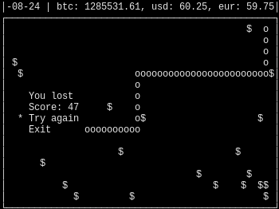

# Snake
Simple console snake written with python with todays exchange rates (for traders chads😎)



## Controls
WASD for move

Enter for confirm

## Instalation
For Unix like systems:
```shell
git clone https://github.com/lattern31/py_snake
./py_snake/snake.py
```

For Windows:
```shell
git clone https://github.com/lattern31/py_snake
```
Then just execute snake.py